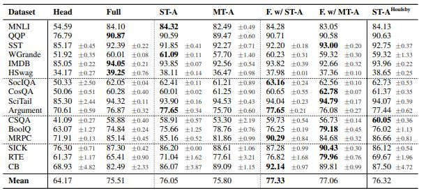

# adapter_experiments

## TODO: description

## TODO: UPDATE CB SIZES

## Supported datasets
| Dataset | Category | Description | (Relevant) Columns | Samples Train | Samples Val| Samples Test |
|---------|----------|-------------|--------------------|---------------|-------|--------|
|MNLI| Natural language inference / sentence entailment| Given a sentence pair classify it as entailment, contradiction or neutral |'premise','hypothesis','label'|  392702|  9815|  9832|
|QQP| Sentence relatedness / sentence similarity| Given a question pair classify it as paraphrase or not |'question1','question2','label'|  363849|  40428|  390965|
|SST2| Sentiment analysis / binary classification| Given a sentence classify it as positive or negative |'sentence','label'|  67349|  872|  1821|
|Winogrande|  Commonsense reasoning / multiple choice| Given a sentence and blank fill in the blank |'sentence','option1','option2','answer'| 40398|1767|1267 |
|IMDB| Sentiment analysis / binary classification| Given a sentence classify it as positive or negative |'text','label'|  25000|  0|  25000|
|Hellaswag|Commonsense reasoning / multiple choice| Given a sentence choose the correct ending |'ctx_a','ctx_b','ctx','endings''label'| 39905|10003|10042 |
|SocialIQA| Commonsense reasoning / multiple choice| Given a sentence and question choose the correct answer |'context','question','answerA','answerB','answerC,'label'|  33410|  1954|  0|
|CosmosQA|  Commonsense reasoning / multiple choice| Given a sentence and question choose the correct answer |'context','question','answer0','answer1','answer2','answer3','label'|  25262|  6963|  2985|
|SciTail| Commonsense reasoning / multiple choice| TODO| TODO | 23097|1304 |2126|
|Argument mining| TODO| TODO |TODO|  18341|  2042|  5109|
|CSQA| TODO| TODO| TODO| 9741|1221|1140|
|BoolQ| Reading comprehesion| Given a question and a sentence answer yes or no |'question','answer','passage'|  9427|  3270|  0|
|MRPC| Sentence relatedness / sentence similarity| Given a sentence pair classify it as paraphrase or not |'sentence1','sentence2','label'|  3668|  408|  1725|
|SICK| Natural language inference / sentence entailment| Given a sentence pair classify it as entailment, contradiction or neutral |'sentence_A','sentence_B','label'|  4439|  495|  4906|
|RTE| Natural language inference / sentence entailment| Given a sentence pair classify the second sentence as entails or does not entail |'sentence1','sentence2','label'|  2490|  277|  3000|
|CB| Natural language inference / sentence entailment| Given a sentence pair classify it as entailment, contradiction or neutral |'premise','hypothesis','label'|  250|  277|  250|

### Results in [AdapterFusion: Non-Destructive Task Composition for Transfer Learning](https://arxiv.org/pdf/2005.00247.pdf) by Pfeiffer et al.(2021)

[paper](https://arxiv.org/pdf/2005.00247.pdf)

